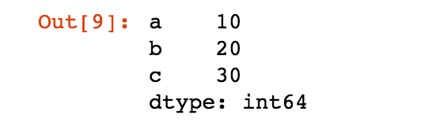

Pandas

In this tutorial, we will be learning about using Pandas.  

Pandas is an open source library built on NumPy.  It has built-in data visualization features and can allow for fast analysis and data cleaning. 

Pandas can be used to work with:
* Series
* DataFrames
* Missing Data
* GroupBy
* Operations
* Data Input and Output 

I will be working in Jupyter notebook, and if you don't have a Python notebook that you currently use, I would recommend it.  You can use Jupyter by downloading Anaconda <a href="https://www.continuum.io/downloads"> here.</a>

First, you'll need to install pandas by going to your command line and using either

```
conda install pandas
```

or

```
pip install pandas
```

<p>Let's start by importing numpy and pandas</p>

```
import numpy as np
```

<p></p>

```
import pandas as pd
```

<p>First, we'll be creating series from various object types.  We'll be creating an array called labels that will be the labels on each axis.  Then, we'll create an array of data and a dictionary of values.</p>

```
labels = ['a', 'b', 'c']
my_data = [10,20,30]
arr = np.array(my_data)
d = {'a':10, 'b': 20, 'c': 30}
```

<p>pd.Series takes a variety of parameters, but in thise case, we'll be passing in our data and labels for each axis.  Unlike a NumPy array, each axis has labels, so we can find elements using the series and the label.  </p>


```
pd.Series(data = my_data, index=labels)
```



<p>Another quick way of creating a series is to just pass in the array followed by the labels</p>

```
pd.Series(arr, labels)
```


<p></p>

```
pd.Series(d)
```


<p>You can even use built-in Python functions as datapoints in your series.  </p>

```
pd.Series(data=[sum, print, len])
```


<p>Pandas uses labels or numbers to allow for very fast lookup of values in a series or table. </p>

```
ser1 = pd.Series([1,2,3,4], ['Apples', 'Oranges', 'Grapefruit', 'Kiwi'])
```


<p>Then, I'll make another similar series, but swap out Grapefruit for Pineapples.</p>

```
ser2 = pd.Series([1,2,5,4], ['Apples', 'Oranges', 'Pineapples', 'Kiwi'])
```

<p>You can access values in a series using their corresponding index labels.  If you type in 'Apples', you will receive the corresponding number 1 in return.  </p>

```
ser1['Apples']

```

<p>You can even add series together, and it will only add together the values that have the same labels:</p>

```
ser1 + ser2

```


<hr>

<h2>DataFrames</h2>

<p>DataFrames will be our main tool for working with pandas.  </p>

```

import numpy as np
import pandas as pd
```

<p></p>

```
from numpy.random import randn

```

<p></p>

```
np.random.seed(101)

```

<p>We need a data argument and an index argument, just like for series, but we also need a column argument.</p>

```
df = pd.DataFrame(randn(5,4), ['A', 'B', 'C', 'D', 'E'], ['W', 'X', 'Y', 'Z'])

```


<p>If you're working in another IDE, you should get a dataframe that looks similar, if not exactly the same.  Every row is a series, so you can think of a DataFrame as several Series put together.  If I display df['W'], you can see that it looks like a Series.</p>

```
df['W']

```


<p>You can confirm this using the following command:</p>

```
type(df['W'])


```

<p>You can also create new columns using the values of existing columns:</p>

```
df['new'] = df['W'] + df['Y']
df

```


<p></p>

```


```